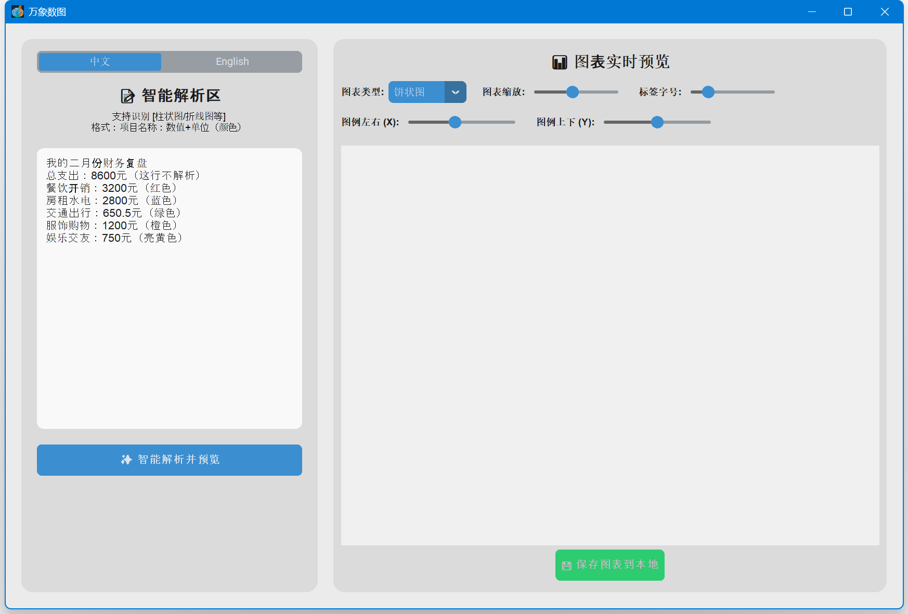
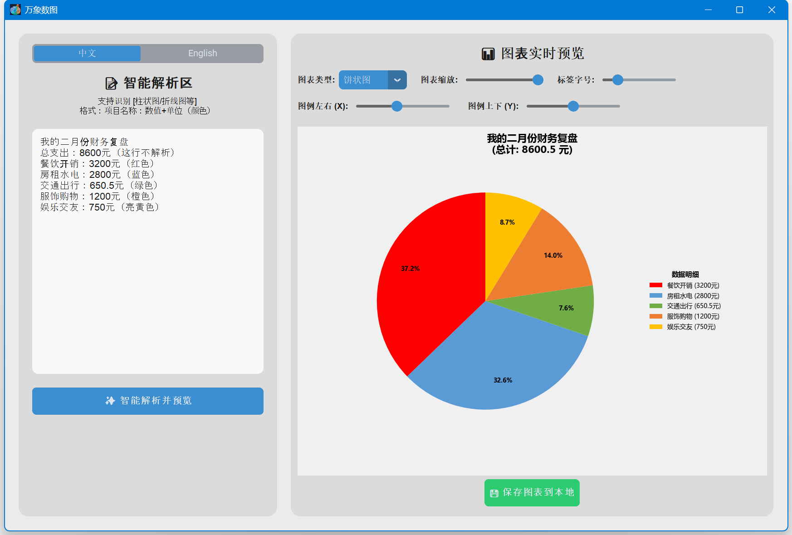
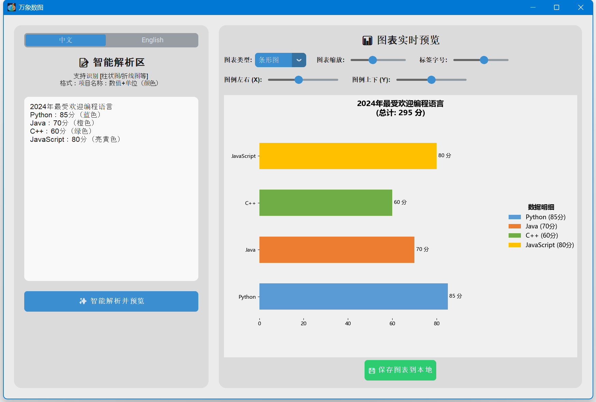
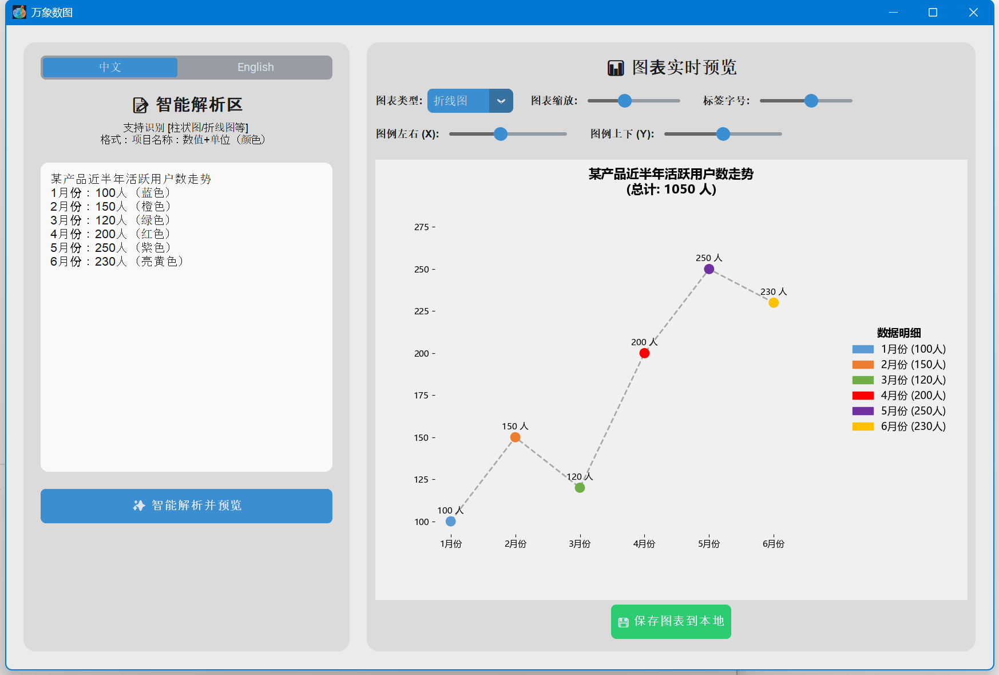
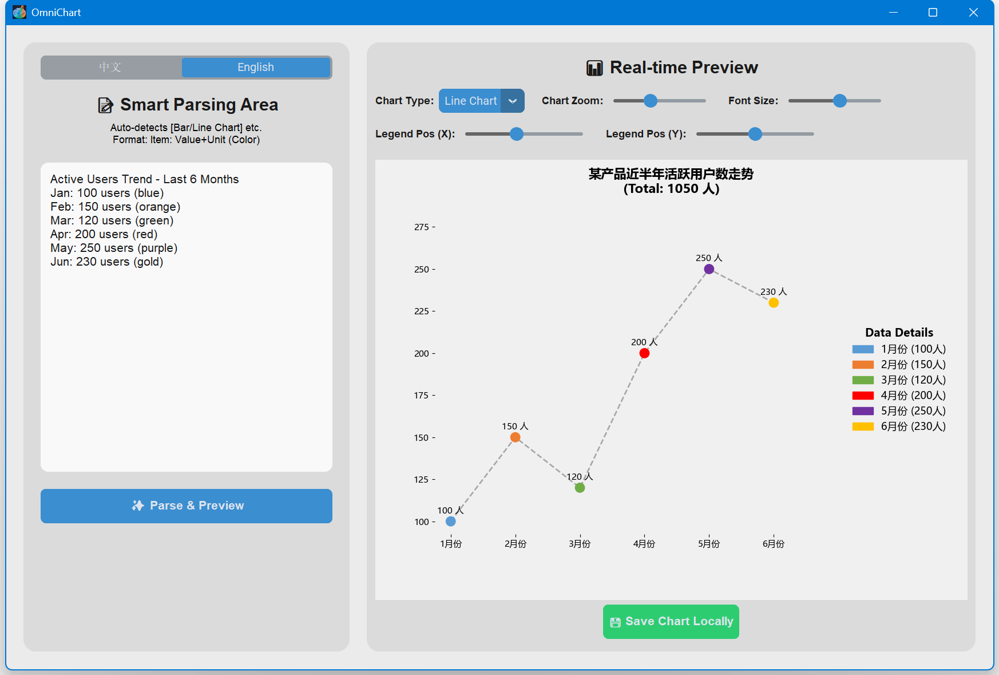

<div align="center">
  <a href="#zh">🇨🇳 简体中文</a> | <a href="#en">🇺🇸 English</a>
</div>

---

<a id="zh"></a>
# 📊 OmniChart (万象数图) - 数据可视化工作站


OmniChart 是一款基于 Python 开发的轻量级、智能化的桌面数据可视化工具。无论你输入的是时间管理复盘、财务支出，还是产品数据，它都能通过 NLP 意图识别，一键将枯燥的文本转化为精美的图表。

> **告别繁琐的 Excel 图表配置，用自然语言驱动你的数据可视化！**

## ✨ 核心特性 (Features)

- 🧠 **NLP 智能解析**：自动识别文本中的图表意图（如“生成柱状图”）、数据、单位和颜色映射。
- 🎨 **多图表支持**：无缝切换 **饼状图、柱状图、条形图、折线图**。
- 🌍 **无缝多语言 (i18n)**：内置中英双语引擎，一键切换界面、提示词与图表内部语言，无需重启。
- ⚡ **实时渲染引擎**：拖动滑块即可毫秒级调整图表缩放、标签字号和图例位置，所见即所得。
- 🌙 **暗黑模式自适应**：跟随系统主题自动切换明/暗色调，极具极客范。
- 🛡️ **超强容错设计**：内置强大的过滤器与 `matplotlib` 原生颜色雷达，彻底免疫无效文本干扰。
- 💾 **一键高清导出**：支持导出无损 `.png` 或 `.jpg` 图表，自动提取文本标题作为文件名。

## 📸 界面预览 (Screenshot)

**中文界面**





**英文界面**


## 🚀 快速开始

### 选项 A：直接下载使用 (推荐给普通用户)
前往 [Releases](../../releases) 页面，下载最新的 `OmniChart.exe`，双击即可直接运行，无需配置任何环境。

### 选项 B：本地源码运行 (推荐给开发者)

**1. 克隆仓库**
```bash
git clone https://github.com/LuckyBoy9533/OmniChart.git
cd OmniChart
```

**2. 安装依赖**
建议使用虚拟环境：
```bash
pip install -r requirements.txt
```

**3. 运行程序**
```bash
python main.py
```

## 🛠️ 如何打包

如果您修改了源码并希望自己生成 `.exe` 文件，只需在 Windows 环境下双击运行根目录下的智能打包脚本：

- `build.bat`

打包完成后，独立的可执行文件将生成在 `dist/` 目录下，并自动附带专属 Logo。

## 💡 使用语法示例

在左侧文本框中输入类似以下格式的内容，点击“智能解析并预览”即可：

```text
帮我生成折线图：近半年活跃用户数走势
1月份：100人（蓝色）
2月份：150人（橙色）
3月份：120人（绿色）
这行是废话，程序会自动忽略！
4月份：200人（红色）
5月份：250人（紫色）
6月份：230人（亮黄色）
```

## 📄 许可证

本项目采用 [MIT License](LICENSE) 开源协议。

<br>

---

<a id="en"></a>
# 📊 OmniChart - Data Visualization Workspace


OmniChart is a lightweight, intelligent desktop data visualization tool built with Python. Whether you input time management reviews, financial expenses, or product data, it uses NLP intent recognition to convert tedious text into beautiful charts with a single click.

> **Say goodbye to tedious Excel chart configurations, and drive your data visualization with natural language!**

## ✨ Features

- 🧠 **NLP Smart Parsing**: Automatically recognizes chart intent (e.g., "generate a bar chart"), data, units, and color mapping from text.
- 🎨 **Multi-Chart Support**: Seamlessly switch between **Pie Charts, Bar Charts, Horizontal Bar Charts, and Line Charts**.
- 🌍 **Seamless Multilingual (i18n)**: Built-in English/Chinese bilingual engine. Switch interface, prompts, and internal chart languages with one click, no restart required.
- ⚡ **Real-Time Rendering Engine**: Adjust chart zoom, label font size, and legend position in milliseconds by dragging sliders. What you see is what you get.
- 🌙 **Adaptive Dark Mode**: Automatically switches light/dark themes following the OS, keeping a highly geeky vibe.
- 🛡️ **Ultra Fault-Tolerant Design**: Built-in powerful filters and `matplotlib`'s native color radar completely immunize against invalid text interference.
- 💾 **One-Click HD Export**: Supports exporting lossless `.png` or `.jpg` charts, automatically extracting the text title as the file name.

## 📸 Screenshot

**Chinese Interface**


**English Interface**


## 🚀 Getting Started

### Option A: Direct Download (Recommended for General Users)
Go to the [Releases](../../releases) page, download the latest `OmniChart.exe`, and double-click to run directly. No environment configuration is required.

### Option B: Run from Source (Recommended for Developers)

**1. Clone the repository**
```bash
git clone https://github.com/LuckyBoy9533/OmniChart.git
cd OmniChart
```

**2. Install dependencies**
Using a virtual environment is recommended:
```bash
pip install -r requirements.txt
```

**3. Run the application**
```bash
python main.py
```

## 🛠️ How to Build

If you modified the source code and wish to generate the `.exe` file yourself, simply double-click the smart build script in the root directory under Windows:

- `build.bat`

After the build is complete, the standalone executable file will be generated in the `dist/` directory, automatically carrying the exclusive Logo.

## 💡 Syntax Example

Input content in the left textbox similar to the following format, and click "Parse & Preview":

```text
Please generate a line chart: Active users trend over the last 6 months
Jan: 100 users (blue)
Feb: 150 users (orange)
Mar: 120 users (green)
This line is nonsense and will be automatically ignored!
Apr: 200 users (red)
May: 250 users (purple)
Jun: 230 users (gold)
```

## 📄 License

This project is licensed under the [MIT License](LICENSE).